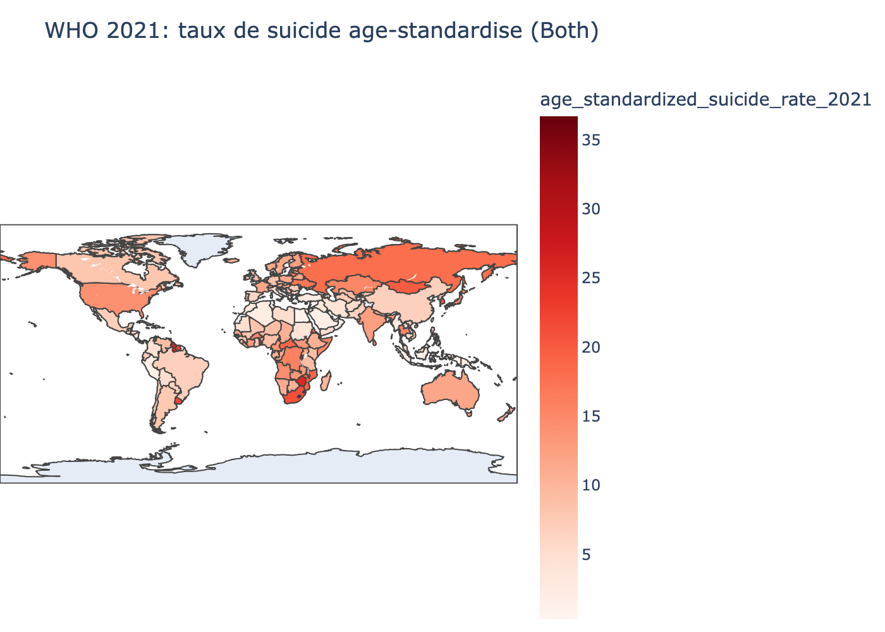
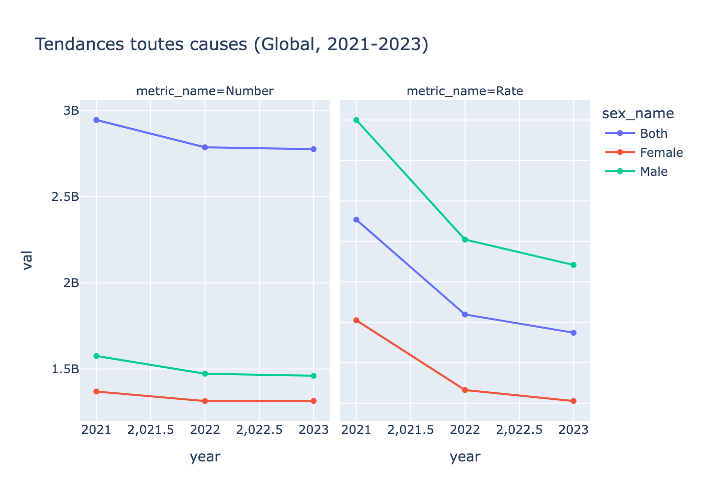
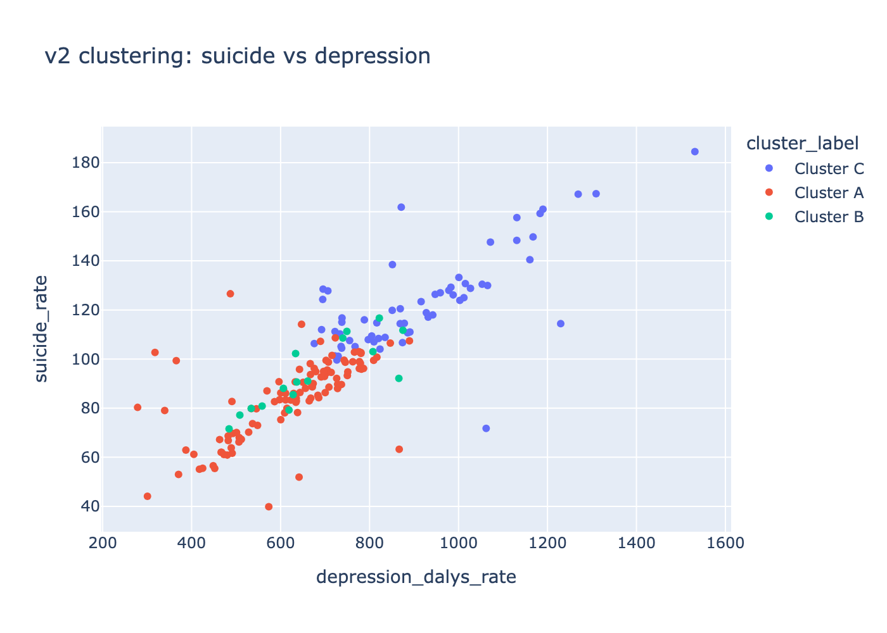
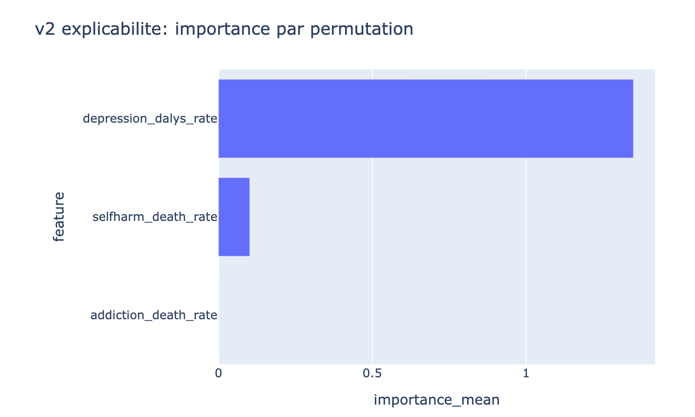
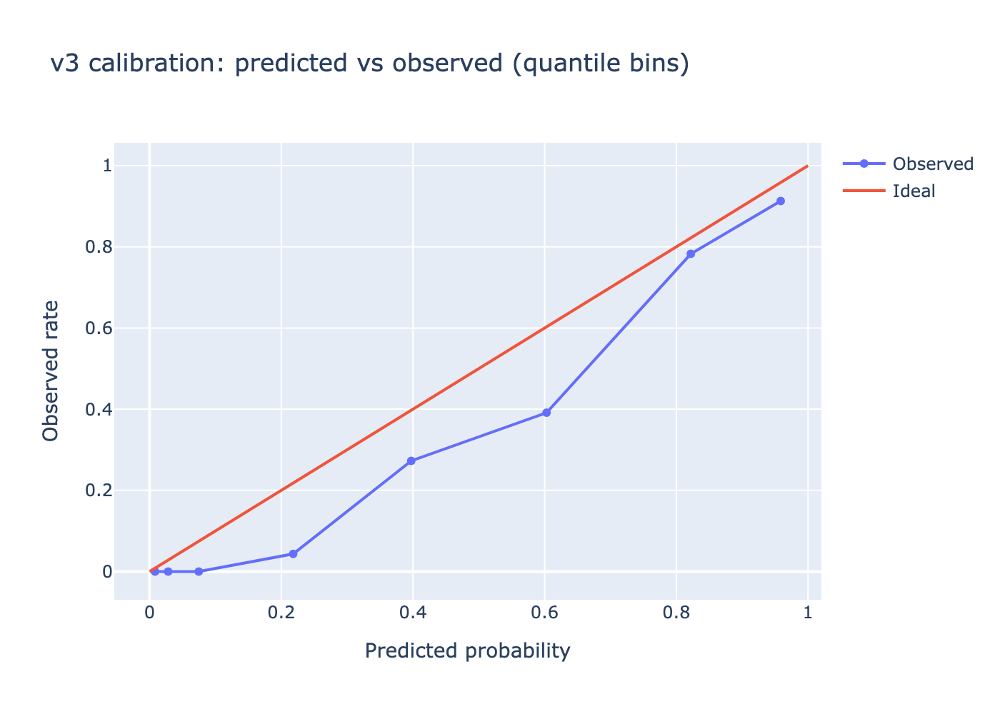
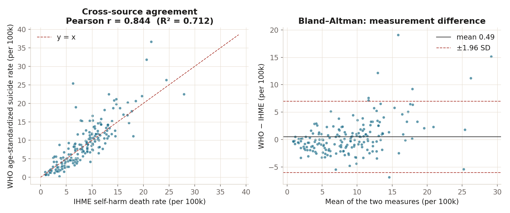
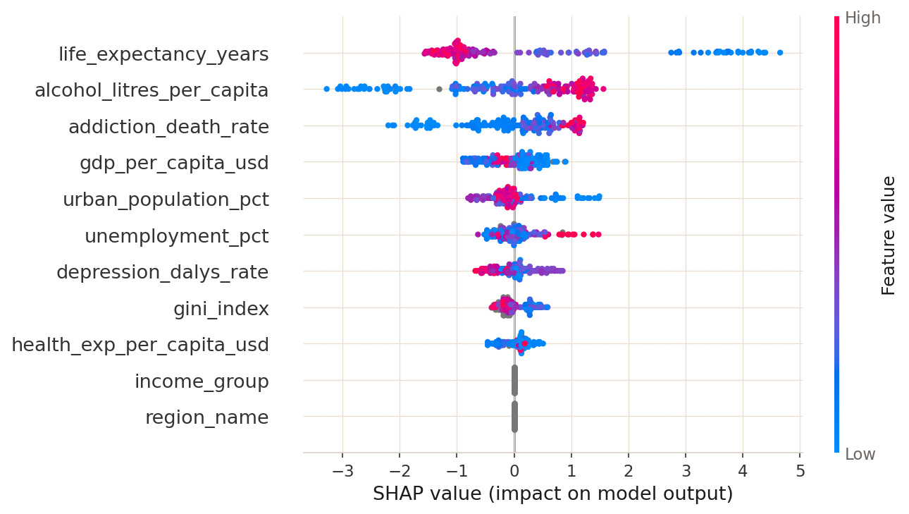
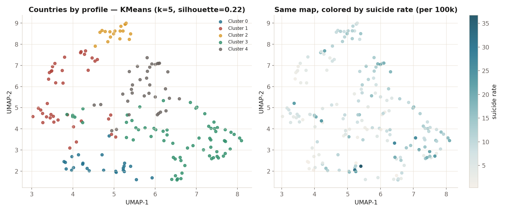
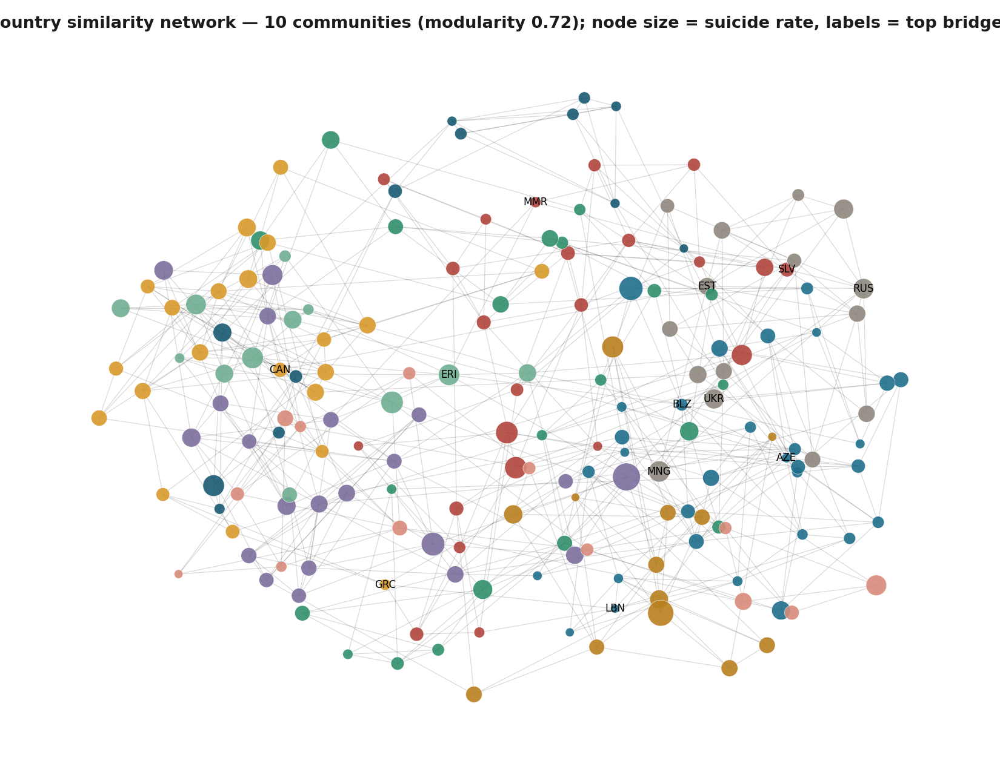

# Mental Health Viz

**Turning global public-health data into clear, decision-friendly stories — from static visuals to calibrated risk models.**

Global mental-health analytics built on WHO (2021) and IHME Global Burden of Disease (2023) data, structured as four progressive versions: a static visual gallery, a real-data BI dashboard with an ML baseline, an advanced-analytics layer (clustering, forecasting, explainability), and an interactive risk estimator.

[](LICENSE)
[](LICENSE-CC-BY-4.0)
[](pyproject.toml)
[](https://streamlit.io)
[](https://github.com/NawfalRAZOUK7/Mental-Health/actions/workflows/ci.yml)

> ⚠️ **Educational project — not a clinical tool.** This work is for learning, BI, and data-storytelling. It is **not** medical advice, diagnosis, or a risk assessment for any real person. Versions **v2 and v3 run on synthetic data** and exist to demonstrate methodology only.

> 🔗 **Live demo:** **[mental-health-iota-vert.vercel.app](https://mental-health-iota-vert.vercel.app)** (website) · **[dashboards](https://mental-health-razouk.streamlit.app)** (Streamlit)

---



## What's inside

<table>
  <tr>
    <td width="50%"><br/><sub><b>v1 — Trends & comparisons</b> across countries and regions</sub></td>
    <td width="50%"><br/><sub><b>v2 — Country segmentation</b> via unsupervised clustering</sub></td>
  </tr>
  <tr>
    <td width="50%"><br/><sub><b>v2 — Explainability</b> (permutation importance)</sub></td>
    <td width="50%"><br/><sub><b>v3 — Calibrated risk estimator</b> with what-if scenarios</sub></td>
  </tr>
</table>

## Why this project

- **Decision-friendly.** Complex indicators (suicide rates, DALYs, self-harm, addiction burden) rendered as clear comparisons a non-specialist can read in seconds.
- **Full-stack analytics.** One cohesive workflow spanning BI structure, reproducible ETL, an ML baseline, advanced data-mining, and an interactive estimator.
- **Reproducible.** One-command pipelines, pinned dependencies, Docker, CI, and a versioned LaTeX report.

## Key findings (v1, real data)

- **Cross-source agreement.** The WHO age-standardized suicide rate and the IHME self-harm death rate agree strongly across 183 countries (**Pearson r = 0.84**, median difference ≈ 1.5 per 100k) — two independent global bodies measuring essentially the same phenomenon.



- **Leakage, made explicit.** Because self-harm ≈ suicide, using it as a "predictor" is a near-tautology. Removing it, cross-validated R² drops from **0.75 → 0.19** (Ridge, 5-fold) — i.e. most of the apparent predictive power was circular. The model is therefore rebuilt on *independent* drivers (see below).
- **What actually drives it.** After enriching with real World Bank covariates (7 indicators, 260 countries), the strongest independent correlates of the national suicide rate are **life expectancy and alcohol consumption per capita**, ahead of unemployment and health spending — epidemiologically sensible signals, not a black box.
- **An honest ceiling.** On independent predictors the suicide rate is only modestly predictable (CV R² ≈ 0.19): suicide is multifactorial and national aggregates wash out much of the signal. Reported against a mean baseline and led by cross-validation — a real finding, not a model failure.
- **Heterogeneity is the story.** Suicide indicators vary sharply across regions, income groups, sex, and age — the signal is regional, not a global average.

_Reproduce: `python src/09_source_agreement.py`, `python src/10_enrich_covariates.py` (fetches covariates), then `python src/11_ml_enriched.py`. Full methodology and limitations are in the report (`report_latex/main.pdf`)._

## Advanced analytics (real data)

A dedicated advanced suite runs modern ML and data-mining on the real, covariate-enriched data (`pip install -r requirements-advanced.txt`, then `python scripts/run_advanced.py`):

- **Tuned gradient boosting** — LightGBM with **Optuna** search inside **nested cross-validation** (no tuning leakage), plus **SHAP** attribution and **split-conformal** prediction intervals (90% target, ~96% empirical coverage). On 183 countries the regularized linear model still competes — an honest finding about small-data limits.
- **Hierarchical mixed-effects model** — partial pooling of countries within WHO regions; **ICC ≈ 0.22** cleanly quantifies geographic clustering, the statistically correct treatment of nested data.
- **UMAP embedding** and a **country-similarity network** (10 communities, modularity 0.72) — real structure, not the synthetic v2 demo.
- **Pattern mining** — subgroup discovery (e.g. low-development African-region countries reach ~76–80% high-suicide share vs a 33% base rate) and FP-Growth association rules with categoricals (e.g. *high alcohol + high addiction ⇒ high suicide*, lift ≈ 2.1).
- **Global forecasting** — a single darts model trained across all country series (N-BEATS when PyTorch is present), beating a naive baseline — the right tool for many short series, replacing the per-series toy RNN.

<table>
  <tr>
    <td width="50%"><br/><sub><b>SHAP</b> — life expectancy & alcohol drive risk</sub></td>
    <td width="50%"><br/><sub><b>UMAP</b> — countries by mental-health profile</sub></td>
  </tr>
</table>



## Project versions

| Version | Focus | Data |
| --- | --- | --- |
| **v0** | Static visual gallery (PNG/HTML), high variety, minimal transforms | Real |
| **v1** | Main dashboard + ML baseline + BI documentation + advanced suite | Real (WHO + GBD + World Bank) |
| **v2** | Advanced-analytics methods showcase (clustering, forecasting, graphs, explainability) | Synthetic |
| **v3** | Interactive risk estimator with calibration & what-if scenarios | Synthetic |

## Tech stack

`Python` · `pandas` / `numpy` · `scikit-learn` · `LightGBM` · `Optuna` · `SHAP` · `statsmodels` · `UMAP` · `darts` · `Plotly` · `Streamlit` · `PyTorch` · `NetworkX` · `Great Expectations` · `LaTeX`

## Quick start

```bash
python -m venv .venv && source .venv/bin/activate
pip install -r requirements.txt
python scripts/run_app.py --version v1   # or v0, v2, v3
```

Switch versions live in the sidebar (no terminal needed), or via `?version=v2` in the URL.

Prefer `make`? `make install && make app`. Prefer containers? `make docker`.

## Build pipelines

```bash
python scripts/run_v1_pipeline.py                        # v1 — real data
pip install -r requirements-v2.txt                       # v2/v3 advanced deps
python scripts/run_v2_pipeline.py                        # v2 — synthetic analytics
python scripts/run_v3_pipeline.py                        # v3 — risk estimator features
MHP_VERSION=v0 python src/v0_visuals.py                  # v0 — static assets
```

## Report

LaTeX sources live in `report_latex/` (report body in French). Build the PDF:

```bash
cd report_latex && latexmk -pdf -interaction=nonstopmode -halt-on-error main.tex
```

Output: `report_latex/main.pdf`.

## Deploy

1. Push this repository to GitHub.
2. In **Streamlit Community Cloud** → **New app** → select repo/branch → main file `src/app.py` → **Deploy**.
3. Paste the resulting URL into the **Live demo** badge at the top of this README.

Notes:
- Default version is v1; users can switch in the sidebar or via `?version=v2`.
- Streamlit Cloud installs `requirements.txt` only. To enable v2/v3 advanced features, merge `requirements-v2.txt` into `requirements.txt` before deploy (heavier build).
- `.streamlit/config.toml` is included with recommended settings.

## Website (Next.js)

A dynamic **Next.js (React)** website (`web/`) presents the project, an interactive **"predict any country"** widget, cards linking to each version's live dashboard (v0–v3), and a lightweight **guide chatbot** (no LLM) that answers from the project's results — SHAP drivers, metrics, subgroups, association rules, and country predictions — never the raw data. Fully **bilingual (English / French)** via a header toggle (site + chatbot); the Streamlit dashboards also carry an EN/FR switch. It builds to a fully static site (predictions baked in), so it needs no backend and deploys free.

```bash
python scripts/build_web_data.py     # bake predictions + copy figures into web/
cd web
npm install
npm run dev                          # develop at http://localhost:3000
npm run build                        # static export -> web/out/  (deploy this)
```

Configure the four dashboard links in `web/lib/versions.js` (paste your deployed Streamlit URLs). Deploy `web/out/` to **Vercel**, **Netlify**, or **GitHub Pages** (for a repo subpath, build with `NEXT_PUBLIC_BASE_PATH=/Mental-Health`). Then paste the URL into the live-demo badge above.

**Getting it all live?** Follow the step-by-step [`DEPLOY.md`](DEPLOY.md) (GitHub → Streamlit → website → wiring the URLs).

## Prediction API & Docker

A **FastAPI** service (`api/`) serves the leakage-free predictor: the national suicide rate from independent drivers, with a 90% conformal interval. It uses a pure scikit-learn model (no torch/LightGBM) so the container is light.

```bash
pip install -r api/requirements.txt
uvicorn api.main:app --reload     # http://localhost:8000/docs (interactive Swagger UI)
```

Endpoints: `GET /health`, `GET /countries`, `GET /predict/{iso3}` (e.g. `/predict/FRA`), `POST /predict` (custom feature payload). Every response carries an educational, non-clinical disclaimer.

**Run everything in containers** — dashboard + API with one command:

```bash
docker compose up --build
# Dashboard → http://localhost:8501    API docs → http://localhost:8000/docs
```

Individual images build from the root `Dockerfile` (dashboard) and `api/Dockerfile` (API).

## Testing & CI

```bash
make install-dev
make lint    # ruff
make test    # pytest smoke tests (API tests skip if FastAPI absent)
```

Every push and pull request runs lint + smoke tests via GitHub Actions (`.github/workflows/ci.yml`).

## Repository layout

```
data_raw/        raw source data (WHO + IHME GBD), shared across versions
src/             ETL, analytics, Streamlit app, and shared theme (see src/README.md)
api/             FastAPI prediction service (+ Dockerfile)
web/             Next.js (React) website with live predictor + guide chatbot
scripts/         one-command pipeline runners
v0/ … v3/        versioned outputs (data, assets, report, notebooks)
report_latex/    final report (LaTeX → PDF)
tests/           smoke tests
.github/         CI workflow, issue/PR templates
DESIGN.md        design system · CONTRIBUTING.md · CODE_OF_CONDUCT.md · SECURITY.md
Dockerfile · docker-compose.yml   containerized dashboard + API
```

`src/README.md` maps the numbered pipeline and modules. `DESIGN.md` documents the shared design system.

## Data, ethics & limitations

- WHO and IHME GBD datasets are used for **educational / academic** purposes under their respective terms.
- **v2 and v3 use synthetic data** generated to demonstrate advanced methods; their outputs are illustrative and must not be read as real-world estimates.
- Nothing here is medical advice, diagnosis, or a clinical risk assessment. If you or someone you know is struggling, please contact a local health professional or crisis line.

## Credits

- WHO suicide statistics (2021)
- IHME Global Burden of Disease (GBD 2023)

## License

- **Code:** MIT (`LICENSE`)
- **Report, figures, and written content:** CC BY 4.0 (`LICENSE-CC-BY-4.0`)

## Citation

> Razouk, N. (2025). *Mental Health Viz: WHO/IHME GBD dashboards and analytics.* GitHub repository. https://github.com/NawfalRAZOUK7/Mental-Health

```bibtex
@misc{razouk2025mentalhealthviz,
  author = {Nawfal Razouk},
  title  = {Mental Health Viz: WHO/IHME GBD dashboards and analytics},
  year   = {2025},
  howpublished = {\url{https://github.com/NawfalRAZOUK7/Mental-Health}},
  note   = {Versioned dashboards (v0-v3), report, and pipelines}
}
```
